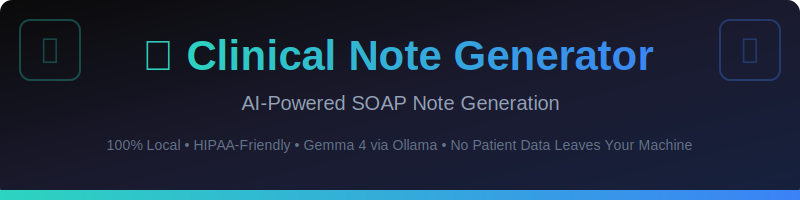
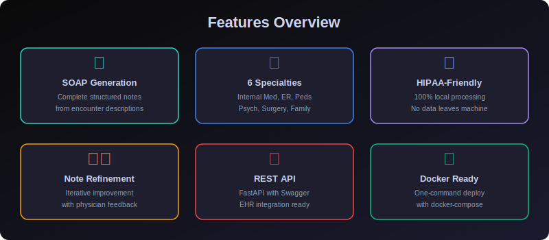

<div align="center">



# 🏥 Clinical Note Generator

### AI-Powered SOAP Note Generation from Patient Encounters

[](https://python.org)
[](https://ollama.com)
[](LICENSE)
[]()
[]()
[]()
[]()

</div>

---

> ## ⚠️ Medical Disclaimer
>
> **This tool is for EDUCATIONAL and INFORMATIONAL purposes ONLY. It is NOT a substitute for professional medical advice, diagnosis, or treatment. Always consult a qualified healthcare provider for any health concerns.**
>
> - 📋 Generated notes are **AI-assisted drafts** and MUST be reviewed by a physician
> - 🚫 Do NOT use generated notes as **final clinical documentation** without review
> - ✅ ALWAYS verify **clinical accuracy** before incorporating into patient records
> - ⚕️ This tool does NOT replace **clinical judgment** or professional documentation
>
> *The developers assume no liability for any actions taken based on this tool's output.*

---

<div align="center">

[✨ Features](#-features) · [🚀 Quick Start](#-quick-start) · [💻 CLI Reference](#-cli-reference) · [🌐 Web UI](#-web-ui) · [🔌 API Reference](#-api-reference) · [🏗️ Architecture](#️-architecture) · [🐳 Docker](#-docker-deployment) · [❓ FAQ](#-faq)

</div>

---

## 📋 Overview

**Clinical Note Generator** transforms free-text patient encounter descriptions into structured **SOAP notes** (Subjective, Objective, Assessment, Plan) using AI — all running **100% locally** on your machine. No patient data ever leaves your computer, making it ideal for healthcare education and documentation assistance.

Built as part of the **Local LLM Projects** series (Project #96), this tool demonstrates how AI can be applied to clinical documentation while maintaining complete data privacy through local model inference with **Gemma 4 via Ollama**.

### Why This Project?

| | Feature | Description |
|---|---------|-------------|
| 📋 | **SOAP Note Generation** | Complete structured clinical notes from encounter descriptions |
| 🏥 | **6 Medical Specialties** | Internal Medicine, Emergency, Pediatrics, Psychiatry, Surgery, Family Medicine |
| 📝 | **6 Note Types** | General, Follow-up, Urgent, Pediatric, Psychiatric, Surgical |
| ✏️ | **Note Refinement** | Iterative improvement with physician feedback |
| 🔍 | **Diagnosis Extraction** | Extract diagnoses and differentials from generated notes |
| 🔒 | **HIPAA-Friendly** | 100% local processing — no patient data leaves your machine |
| 🖥️ | **CLI Interface** | Beautiful terminal UI with Click + Rich |
| 🌐 | **Web UI** | Streamlit-based browser interface on port 8501 |
| 🔌 | **REST API** | FastAPI with Swagger docs on port 8000 |
| 🐳 | **Docker Ready** | One-command deployment with docker-compose |
| 📊 | **Session Tracking** | Track generated notes within a session |
| ⚙️ | **Configurable** | YAML-based configuration for all settings |



---

## 🚀 Quick Start

### Prerequisites

| Requirement | Version | Purpose |
|-------------|---------|---------|
| [Python](https://python.org) | 3.10+ | Runtime |
| [Ollama](https://ollama.com) | Latest | Local LLM server |
| [Gemma 4](https://ollama.com/library/gemma4) | Latest | AI model |

### Installation

```bash
# 1. Clone the repository (or navigate to project directory)
cd 96-clinical-note-generator

# 2. Install dependencies
pip install -r requirements.txt

# 3. Install package in development mode
pip install -e .

# 4. Start Ollama (if not already running)
ollama serve

# 5. Pull the Gemma 4 model (first time only)
ollama pull gemma4

# 6. Verify setup
python -c "from common.llm_client import check_ollama_running; print('✅ Ready!' if check_ollama_running() else '❌ Start Ollama')"
```

### Quick Usage

```bash
# Generate a SOAP note via CLI
python -m clinical_note_generator.cli generate \
  --encounter "55yo male with 3-day chest pain, worse with inspiration. PMH: HTN, DM2." \
  --specialty internal_medicine \
  --type general

# Launch the Web UI
streamlit run src/clinical_note_generator/web_ui.py

# Start the REST API
uvicorn src.clinical_note_generator.api:app --host 0.0.0.0 --port 8000
```

---

## 💻 CLI Reference

The CLI is built with [Click](https://click.palletsprojects.com/) and [Rich](https://rich.readthedocs.io/) for a beautiful terminal experience.

### `generate` — Generate a Full SOAP Note

```bash
python -m clinical_note_generator.cli generate \
  --encounter "ENCOUNTER_DESCRIPTION" \
  --type NOTE_TYPE \
  --specialty SPECIALTY \
  --age "PATIENT_AGE" \
  --sex "PATIENT_SEX"
```

**Options:**

| Option | Short | Default | Description |
|--------|-------|---------|-------------|
| `--encounter` | `-e` | *required* | Patient encounter description |
| `--type` | `-t` | `general` | Note type: general, follow_up, urgent, pediatric, psychiatric, surgical |
| `--specialty` | `-s` | `internal_medicine` | Medical specialty |
| `--age` | | None | Patient age |
| `--sex` | | None | Patient sex |

**Example — Internal Medicine Visit:**

```bash
python -m clinical_note_generator.cli generate \
  -e "55-year-old male presents with 3-day history of progressive chest pain, worse with deep inspiration. Reports mild shortness of breath on exertion. No fever, chills, or cough. PMH: HTN, DM2, hyperlipidemia. Vitals: BP 145/90, HR 88, RR 18, Temp 98.6F, SpO2 96% on RA. Lungs clear bilaterally. Heart RRR, no murmurs." \
  -t general \
  -s internal_medicine \
  --age 55 \
  --sex Male
```

**Example — Psychiatric Evaluation:**

```bash
python -m clinical_note_generator.cli generate \
  -e "32-year-old female presents with worsening anxiety and insomnia for 4 weeks. Reports difficulty concentrating at work, irritability, and muscle tension. Denies suicidal ideation. PHQ-9 score: 12. GAD-7 score: 15." \
  -t psychiatric \
  -s psychiatry
```

**Example — Pediatric Visit:**

```bash
python -m clinical_note_generator.cli generate \
  -e "3-year-old male brought by mother for fever and cough for 2 days. Temp 101.2F, otherwise playful and interactive. Up to date on vaccinations." \
  -t pediatric \
  -s pediatrics \
  --age 3 \
  --sex Male
```

### `section` — Generate a Specific SOAP Section

```bash
python -m clinical_note_generator.cli section \
  --encounter "Patient encounter description" \
  --section S   # S=Subjective, O=Objective, A=Assessment, P=Plan
```

**Example — Generate Only the Plan:**

```bash
python -m clinical_note_generator.cli section \
  -e "45yo female with new onset type 2 diabetes, HbA1c 8.2%, BMI 32" \
  -s P
```

### `templates` — List Available Note Templates

```bash
python -m clinical_note_generator.cli templates
```

Output:

```
📋 Note Templates
┌────────────┬──────────────────────────────────────────────────┐
│ Type       │ Description                                      │
├────────────┼──────────────────────────────────────────────────┤
│ general    │ Standard office visit SOAP note                  │
│ follow_up  │ Follow-up visit for existing condition           │
│ urgent     │ Urgent/acute care visit                          │
│ pediatric  │ Pediatric visit with age-appropriate docs        │
│ psychiatric│ Psychiatric evaluation with mental status exam   │
│ surgical   │ Pre-operative or post-operative note             │
└────────────┴──────────────────────────────────────────────────┘
```

### `specialties` — List Available Medical Specialties

```bash
python -m clinical_note_generator.cli specialties
```

Output:

```
🏥 Medical Specialties
┌───────────────────┬──────────────────────────────────────────────────────────────────┐
│ Specialty         │ Focus                                                            │
├───────────────────┼──────────────────────────────────────────────────────────────────┤
│ internal_medicine │ Comprehensive medical history, systems review, chronic disease   │
│ emergency         │ Chief complaint, acute findings, disposition, time-critical      │
│ pediatrics        │ Developmental milestones, growth parameters, age-specific        │
│ psychiatry        │ Mental status examination, risk assessment, psychosocial         │
│ surgery           │ Surgical indications, operative findings, post-op planning       │
│ family_medicine   │ Preventive care, screening recommendations, health maintenance  │
└───────────────────┴──────────────────────────────────────────────────────────────────┘
```

---

## 🌐 Web UI

The Streamlit-based web interface provides a professional, dark-themed browser experience.

### Launch

```bash
streamlit run src/clinical_note_generator/web_ui.py
```

Then open **http://localhost:8501** in your browser.

### Features

- **📝 Encounter Input** — Large text area for describing the patient encounter
- **⚙️ Sidebar Configuration** — Select note type, specialty, and patient demographics
- **📋 Full SOAP Generation** — Generate complete structured notes with one click
- **📄 Section Generation** — Generate individual S, O, A, or P sections
- **✏️ Note Refinement** — Iteratively improve notes with physician feedback
- **📊 Session Tracking** — Track how many notes you've generated in the session
- **🏥 SOAP Reference** — Quick reference panel for SOAP note structure
- **⚠️ Disclaimer Display** — Prominent medical disclaimer on every page

### Configuration Sidebar

| Setting | Options | Description |
|---------|---------|-------------|
| Note Type | 6 types | Select the type of clinical note |
| Specialty | 6 specialties | Choose the medical specialty |
| Patient Age | Free text | Optional patient age |
| Patient Sex | Male/Female/Other | Optional patient sex |

---

## 🔌 API Reference

The REST API is built with [FastAPI](https://fastapi.tiangolo.com/) and provides automatic Swagger documentation.

### Launch

```bash
uvicorn src.clinical_note_generator.api:app --host 0.0.0.0 --port 8000
```

- **Swagger UI**: http://localhost:8000/docs
- **ReDoc**: http://localhost:8000/redoc

### Endpoints

#### `GET /health` — Health Check

```bash
curl http://localhost:8000/health
```

Response:

```json
{
  "status": "healthy",
  "service": "clinical-note-generator"
}
```

#### `POST /generate` — Generate Full SOAP Note

```bash
curl -X POST http://localhost:8000/generate \
  -H "Content-Type: application/json" \
  -d '{
    "encounter_description": "55-year-old male with 3-day chest pain, worse with inspiration. PMH: HTN, DM2. Vitals: BP 145/90, HR 88, RR 18, SpO2 96%.",
    "patient_demographics": {"age": "55", "sex": "Male"},
    "note_type": "general",
    "specialty": "internal_medicine"
  }'
```

Response:

```json
{
  "note": "**SUBJECTIVE (S):**\nChief Complaint: Chest pain for 3 days...\n\n**OBJECTIVE (O):**\nVitals: BP 145/90, HR 88...\n\n**ASSESSMENT (A):**\n1. Pleuritic chest pain...\n\n**PLAN (P):**\n1. Obtain chest X-ray...\n\n⚠️ This note is AI-generated and must be reviewed by the treating physician.",
  "disclaimer": "⚠️ This API generates AI-assisted drafts..."
}
```

#### `POST /generate/section` — Generate Specific Section

```bash
curl -X POST http://localhost:8000/generate/section \
  -H "Content-Type: application/json" \
  -d '{
    "encounter_description": "45yo female with acute onset headache, worst of her life. No history of migraines.",
    "section": "A"
  }'
```

Response:

```json
{
  "section": "A",
  "content": "**ASSESSMENT:**\n1. Thunderclap headache — must rule out subarachnoid hemorrhage (SAH)...",
  "disclaimer": "⚠️ This API generates AI-assisted drafts..."
}
```

#### `POST /refine` — Refine a Note with Feedback

```bash
curl -X POST http://localhost:8000/refine \
  -H "Content-Type: application/json" \
  -d '{
    "original_note": "S: Patient with headache...\nO: Vitals stable...\nA: Tension headache\nP: Acetaminophen",
    "feedback": "Add more detail to the Plan section. Include follow-up timeline and red flag symptoms."
  }'
```

Response:

```json
{
  "refined_note": "S: Patient with headache...\n\n**PLAN (P):**\n1. Acetaminophen 650mg PO q6h PRN...\n2. Return precautions: sudden severe headache...\n3. Follow up in 1-2 weeks...",
  "disclaimer": "⚠️ This API generates AI-assisted drafts..."
}
```

#### `POST /extract-diagnoses` — Extract Diagnoses

```bash
curl -X POST http://localhost:8000/extract-diagnoses \
  -H "Content-Type: application/json" \
  -d '{
    "encounter_description": "Patient with chest pain and shortness of breath"
  }'
```

Response:

```json
{
  "diagnoses": [
    "Pleuritic chest pain",
    "Acute coronary syndrome (to rule out)",
    "Pulmonary embolism (to rule out)"
  ],
  "disclaimer": "⚠️ This API generates AI-assisted drafts..."
}
```

#### `GET /templates` — List Note Templates

```bash
curl http://localhost:8000/templates
```

Response:

```json
{
  "templates": {
    "general": "Standard office visit SOAP note",
    "follow_up": "Follow-up visit for existing condition",
    "urgent": "Urgent/acute care visit",
    "pediatric": "Pediatric visit with age-appropriate documentation",
    "psychiatric": "Psychiatric evaluation with mental status exam",
    "surgical": "Pre-operative or post-operative note"
  },
  "disclaimer": "⚠️ This API generates AI-assisted drafts..."
}
```

#### `GET /specialties` — List Specialties

```bash
curl http://localhost:8000/specialties
```

Response:

```json
{
  "specialties": [
    "internal_medicine",
    "emergency",
    "pediatrics",
    "psychiatry",
    "surgery",
    "family_medicine"
  ],
  "disclaimer": "⚠️ This API generates AI-assisted drafts..."
}
```

#### `GET /disclaimer` — Get Medical Disclaimer

```bash
curl http://localhost:8000/disclaimer
```

---

## 🏗️ Architecture


### Component Overview

```
96-clinical-note-generator/
├── src/clinical_note_generator/
│   ├── __init__.py          # Package metadata
│   ├── config.py            # YAML configuration management
│   ├── core.py              # Core SOAP generation engine
│   ├── cli.py               # Click + Rich CLI interface
│   ├── web_ui.py            # Streamlit web interface
│   └── api.py               # FastAPI REST API
├── tests/
│   └── test_core.py         # Pytest unit tests
├── examples/
│   ├── demo.py              # Quick demo script
│   └── README.md            # Examples documentation
├── common/
│   ├── __init__.py
│   └── llm_client.py        # Shared Ollama client utility
├── docs/images/             # SVG assets
├── .github/workflows/       # CI/CD pipeline
├── config.yaml              # User configuration
├── requirements.txt         # Python dependencies
├── setup.py                 # Package setup
├── Dockerfile               # Container image
├── docker-compose.yml       # Multi-service deployment
└── README.md                # This file
```

### Data Flow

```
┌─────────────────────┐
│  User Input         │  Free-text encounter description
│  (CLI/Web/API)      │  + demographics, specialty, note type
└────────┬────────────┘
         │
         ▼
┌─────────────────────┐
│  Core Engine        │  Builds prompt with specialty-specific
│  (core.py)          │  guidance and SOAP formatting rules
└────────┬────────────┘
         │
         ▼
┌─────────────────────┐
│  Ollama (Gemma 4)   │  Local LLM generates structured
│  localhost:11434    │  SOAP note — no data leaves machine
└────────┬────────────┘
         │
         ▼
┌─────────────────────┐
│  Formatted Output   │  Structured S/O/A/P sections
│  + Disclaimer       │  with ICD-10 codes & disclaimer
└─────────────────────┘
```

---

## 🐳 Docker Deployment

### Quick Start with Docker Compose

```bash
# Start all services (Web UI + API + Ollama)
docker-compose up -d

# Pull the Gemma 4 model (first time only)
docker-compose exec ollama ollama pull gemma4

# Access the services
# Web UI: http://localhost:8501
# API:    http://localhost:8000
# Docs:   http://localhost:8000/docs
```

### Services

| Service | Port | Description |
|---------|------|-------------|
| `clinical-note-generator` | 8501 | Streamlit Web UI |
| `api` | 8000 | FastAPI REST API |
| `ollama` | 11434 | Ollama LLM server |

### Build Only

```bash
# Build the Docker image
docker build -t clinical-note-generator .

# Run standalone (requires Ollama running on host)
docker run -p 8501:8501 \
  -e OLLAMA_HOST=http://host.docker.internal:11434 \
  clinical-note-generator
```

### Stop Services

```bash
docker-compose down
```

---

## ⚙️ Configuration

### config.yaml

```yaml
# Clinical Note Generator Configuration
model: "gemma4"              # Ollama model name
temperature: 0.3             # Lower = more consistent medical output
max_tokens: 2048             # Max response length
log_level: "INFO"            # Logging level (DEBUG, INFO, WARNING, ERROR)
ollama_url: "http://localhost:11434"  # Ollama server URL

# Note generation settings
note:
  include_icd_codes: true    # Include ICD-10 codes in assessments
  include_disclaimer: true   # Append disclaimer to notes
  default_specialty: "internal_medicine"

# UI Settings
ui:
  theme: "medical"
  show_disclaimer: true
```

### Environment Variables

| Variable | Default | Description |
|----------|---------|-------------|
| `OLLAMA_HOST` | `http://localhost:11434` | Ollama server URL |
| `OLLAMA_MODEL` | `gemma4` | Default model name |
| `LOG_LEVEL` | `INFO` | Logging verbosity |

### .env.example

```bash
cp .env.example .env
# Edit .env with your settings
```

---

## 📊 Session Tracking

The `NoteSession` class tracks generated notes within a session:

```python
from clinical_note_generator.core import NoteSession

session = NoteSession()

# Generate and track notes
session.add_note(encounter, note, "general", "internal_medicine")
session.add_note(encounter2, note2, "urgent", "emergency")

# Get session summary
summary = session.get_summary()
# {'total_notes': 2, 'note_types': ['general', 'urgent'], 'specialties': ['internal_medicine', 'emergency']}

# Get all notes
all_notes = session.get_notes()
```

---

## 🔒 HIPAA-Friendly Design

This tool is designed with privacy as a core principle:

| Aspect | Implementation |
|--------|---------------|
| **Data Processing** | 100% local — Gemma 4 runs on your machine via Ollama |
| **Network Traffic** | No patient data transmitted to external servers |
| **Data Storage** | No patient data is persisted to disk by default |
| **Model Location** | Model weights stored locally in Ollama's data directory |
| **API Calls** | Only `localhost` communication between app and Ollama |
| **Session Data** | In-memory only — cleared when the application stops |
| **Docker Network** | Internal bridge network — no external exposure |

### Why "HIPAA-Friendly" (Not "HIPAA-Compliant")?

HIPAA compliance requires organizational policies, procedures, training, and technical safeguards beyond any single software tool. This tool supports HIPAA goals by:

- ✅ Keeping all data processing local
- ✅ Not transmitting PHI (Protected Health Information) externally
- ✅ Not persisting patient data by default
- ✅ Providing clear disclaimers on all output

However, full HIPAA compliance depends on your organization's complete security framework.

---

## 🧪 Testing

```bash
# Run all tests
pytest tests/ -v --tb=short

# Run with coverage
pytest tests/ -v --cov=src/ --cov-report=term-missing

# Run specific test class
pytest tests/test_core.py::TestGenerateSoapNote -v

# Run specific test
pytest tests/test_core.py::TestNoteSession::test_add_note -v
```

### Test Categories

| Category | Tests | Description |
|----------|-------|-------------|
| `TestDisclaimer` | 3 | Validates disclaimer content |
| `TestNoteTemplates` | 3 | Verifies note template structure |
| `TestSpecialties` | 3 | Validates specialty configurations |
| `TestGenerateSoapNote` | 5 | Core SOAP generation with mocked LLM |
| `TestGenerateNoteSection` | 2 | Individual section generation |
| `TestRefineNote` | 2 | Note refinement with feedback |
| `TestExtractDiagnoses` | 2 | Diagnosis extraction |
| `TestNoteSession` | 5 | Session tracking functionality |
| `TestConfig` | 3 | Configuration loading |

---

## 📝 Programmatic Usage

```python
from clinical_note_generator.core import (
    generate_soap_note,
    generate_note_section,
    refine_note,
    extract_diagnoses,
)

# Generate a complete SOAP note
encounter = """
55-year-old male presents with 3-day history of progressive chest pain,
worse with deep inspiration. Reports mild shortness of breath on exertion.
No fever, chills, or cough. PMH: HTN, DM2, hyperlipidemia.
Vitals: BP 145/90, HR 88, RR 18, Temp 98.6F, SpO2 96% on RA.
"""

note = generate_soap_note(
    encounter_description=encounter,
    patient_demographics={"age": "55", "sex": "Male"},
    note_type="general",
    specialty="internal_medicine",
)
print(note)

# Generate only the Assessment section
assessment = generate_note_section(encounter, section="A")
print(assessment)

# Refine with physician feedback
refined = refine_note(note, "Add troponin levels to the Plan and include cardiology referral")
print(refined)

# Extract diagnoses
diagnoses = extract_diagnoses(note)
for dx in diagnoses:
    print(f"  • {dx}")
```

---

## ❓ FAQ

<details>
<summary><b>Q: Can I use this for real clinical documentation?</b></summary>

**A:** This tool generates **AI-assisted drafts only**. All output MUST be reviewed, edited, and approved by a qualified physician before use in any clinical documentation. Never rely solely on AI-generated notes.
</details>

<details>
<summary><b>Q: Is my patient data safe?</b></summary>

**A:** Yes — all processing happens locally on your machine using Ollama. No patient data is transmitted to external servers. However, you should still follow your organization's data handling policies.
</details>

<details>
<summary><b>Q: Which Ollama model should I use?</b></summary>

**A:** We recommend **Gemma 4** for the best balance of quality and speed. You can configure other models in `config.yaml`, but results may vary with different models.
</details>

<details>
<summary><b>Q: Why is the first generation slow?</b></summary>

**A:** The first request may take longer as Ollama loads the model into memory. Subsequent requests will be faster. Ensure you have sufficient RAM (16GB+ recommended).
</details>

<details>
<summary><b>Q: Can I add custom specialties?</b></summary>

**A:** Yes! Add new entries to the `SPECIALTY_PROMPTS` dictionary in `core.py` with specialty-specific guidance text.
</details>

<details>
<summary><b>Q: How do I run just the API without the Web UI?</b></summary>

**A:** Use: `uvicorn src.clinical_note_generator.api:app --host 0.0.0.0 --port 8000`
</details>

<details>
<summary><b>Q: Can I integrate this with my EHR system?</b></summary>

**A:** The REST API provides standard HTTP endpoints that can be integrated with EHR systems. You would need to build a custom integration layer for your specific EHR.
</details>

<details>
<summary><b>Q: What ICD-10 codes are included?</b></summary>

**A:** The AI model includes commonly associated ICD-10 codes in the Assessment section when appropriate. These codes should always be verified by the physician.
</details>

---

## 🤝 Contributing

Contributions are welcome! Please see [CONTRIBUTING.md](CONTRIBUTING.md) for guidelines.

```bash
# Development setup
python -m venv venv
source venv/bin/activate  # or venv\Scripts\activate on Windows
pip install -e ".[dev]"
pytest tests/ -v
```

---

## 📜 License

This project is licensed under the MIT License — see the [LICENSE](../LICENSE) file for details.

---

## 📦 Part of the Local LLM Projects Collection

This is **Project #96** in the [90 Local LLM Projects](https://github.com/kennedyraju55/90-local-llm-projects) collection — a series of practical AI tools powered by local language models for complete data privacy.

---

<div align="center">

> ## ⚠️ Final Reminder — Medical Disclaimer
>
> **This tool generates AI-assisted clinical note drafts for EDUCATIONAL and INFORMATIONAL purposes ONLY.**
>
> All generated notes **MUST** be reviewed and approved by a qualified physician before use in clinical documentation. This tool does **NOT** replace clinical judgment, professional medical advice, or proper documentation practices.
>
> The developers assume **NO LIABILITY** for any actions taken based on this tool's output.

---

**Built with ❤️ for healthcare education • 100% Local Processing • HIPAA-Friendly**

*Powered by [Ollama](https://ollama.com) + [Gemma 4](https://ai.google.dev/gemma) • Part of the Local LLM Projects Collection*

</div>
